# TP2 ROS : Les outils de développements de ROS 2

## 1 Design d’une architecture

### 1.1 Présentation du problème

#### Question 1.

```
arne@arne-G3-3500:~/workspaceTdRos/src$ ros2 pkg create --build-type ament_cmake td2 --dependencies rclcpp example_interfaces tf2 geometry_msgs tf2_geometry_msgs
going to create a new package
package name: td2
destination directory: /home/arne/workspaceTdRos/src
package format: 3
version: 0.0.0
description: TODO: Package description
maintainer: ['arne <arne.jacobs@ensta-bretagne.com>']
licenses: ['TODO: License declaration']
build type: ament_cmake
dependencies: ['rclcpp', 'example_interfaces', 'tf2', 'geometry_msgs', 'tf2_geometry_msgs']
creating folder ./td2
creating ./td2/package.xml
creating source and include folder
creating folder ./td2/src
creating folder ./td2/include/td2
creating ./td2/CMakeLists.txt

[WARNING]: Unknown license 'TODO: License declaration'.  This has been set in the package.xml, but no LICENSE file has been created.
It is recommended to use one of the ament license identitifers:
Apache-2.0
BSL-1.0
BSD-2.0
BSD-2-Clause
BSD-3-Clause
GPL-3.0-only
LGPL-3.0-only
MIT
MIT-0
arne@arne-G3-3500:~/workspaceTdRos/src$ cd ..
arne@arne-G3-3500:~/workspaceTdRos$ colcon build --packages-select td2
Starting >>> td2     
Finished <<< td2 [2.24s]                  

Summary: 1 package finished [3.20s]
```

### 1.2 Rappels & Aide

Pour trouver les noms des fichier.hpp, cad leurs noms exacts on peut utiliser find dans /opt/ros/humble :
```
arne@arne-G3-3500:~/workspaceTdRos$ cd /opt/ros/
arne@arne-G3-3500:/opt/ros$ cd humble/
arne@arne-G3-3500:/opt/ros/humble$ find . -name "*pose_stamped*"
./local/lib/python3.10/dist-packages/geometry_msgs/msg/_pose_stamped_s.c
./local/lib/python3.10/dist-packages/geometry_msgs/msg/_pose_stamped.py
./include/geometry_msgs/geometry_msgs/msg/pose_stamped.hpp
./include/geometry_msgs/geometry_msgs/msg/pose_stamped.h
./include/geometry_msgs/geometry_msgs/msg/detail/pose_stamped__rosidl_typesupport_introspection_c.h
./include/geometry_msgs/geometry_msgs/msg/detail/pose_stamped__type_support.cpp
./include/geometry_msgs/geometry_msgs/msg/detail/pose_stamped__struct.hpp
./include/geometry_msgs/geometry_msgs/msg/detail/pose_stamped__functions.c
./include/geometry_msgs/geometry_msgs/msg/detail/pose_stamped__rosidl_typesupport_introspection_cpp.hpp
./include/geometry_msgs/geometry_msgs/msg/detail/pose_stamped__type_support.c
./include/geometry_msgs/geometry_msgs/msg/detail/pose_stamped__builder.hpp
./include/geometry_msgs/geometry_msgs/msg/detail/pose_stamped__type_support.h
./include/geometry_msgs/geometry_msgs/msg/detail/pose_stamped__functions.h
./include/geometry_msgs/geometry_msgs/msg/detail/pose_stamped__traits.hpp
./include/geometry_msgs/geometry_msgs/msg/detail/pose_stamped__rosidl_typesupport_fastrtps_c.h
./include/geometry_msgs/geometry_msgs/msg/detail/pose_stamped__struct.h
./include/geometry_msgs/geometry_msgs/msg/detail/pose_stamped__rosidl_typesupport_fastrtps_cpp.hpp

```

## 2 Simulateur du bateau

### 2.1 Premiers pas

#### Question 2.

Voir les fichiers : NodeSimu.cpp et NodeSimu.hpp.

#### Question 3.

Voici pour u = 0.9 et dt = 0.01 :
Terminal 1 :
```
arne@arne-G3-3500:~/workspaceTdRos$ ros2 run td2 NodeSimu
```
Terminal 2:
```
arne@arne-G3-3500:~/workspaceTdRos$ ros2 topic echo /topic_simu
header:
  stamp:
    sec: 1706190882
    nanosec: 132402987
  frame_id: ''
pose:
  position:
    x: 0.06997088231568546
    y: 0.0016796237555148823
    z: 0.0
  orientation:
    x: 0.0
    y: 0.0
    z: 0.027996342806157728
    w: 0.9996080255727643
---
header:
  stamp:
    sec: 1706190882
    nanosec: 632403006
  frame_id: ''
pose:
  position:
    x: 0.07995520618830804
    y: 0.002239331122118879
    z: 0.0
  orientation:
    x: 0.0
    y: 0.0
    z: 0.031994540465420426
    w: 0.9994880436405463
---
header:
  stamp:
    sec: 1706190883
    nanosec: 132480280
  frame_id: ''
pose:
  position:
    x: 0.08993473295285635
    y: 0.0028788943209627545
    z: 0.0
  orientation:
    x: 0.0
    y: 0.0
    z: 0.0359922262126696
    w: 0.9993520699194334
---
header:
  stamp:
    sec: 1706190883
    nanosec: 632367215
  frame_id: ''
pose:
  position:
    x: 0.09990882392296316
    y: 0.003598272420216198
    z: 0.0
  orientation:
    x: 0.0
    y: 0.0
    z: 0.0399893360850125
    w: 0.9992001065850022
---
```

### 2.2 Découverte de RQT & outils de plot

#### Question 4 et 5.

Pour lancer rqt :
```
arne@arne-G3-3500:~/workspaceTdRos$ rqt
```
Dedans on peut afficher les informations sur les nodes et les topics. On peut aussi afficher les graphes des topics et des nodes (voir la photo suivante):


PS : j'ai rajouté ceci :
```
msg.header.stamp = this->now(); // retourne un objet de type rclcpp::Time
```
Pour afficher les temps dans le graphe.

#### Question 6.

Terminal 1 :
```
arne@arne-G3-3500:~/workspaceTdRos$ ros2 run td2 NodeSimu
[INFO] [1706202529.735588089] [nodeSimu]: Commande Twist reçue : 0.000000
u1 = 0
[INFO] [1706202530.733768366] [nodeSimu]: Commande Twist reçue : 0.000000
u1 = 0
[INFO] [1706202531.735074422] [nodeSimu]: Commande Twist reçue : 0.000000
u1 = 0
```
Terminal 2 :
```
rqt
```
Sur rqt avec `angular.z = 0` :

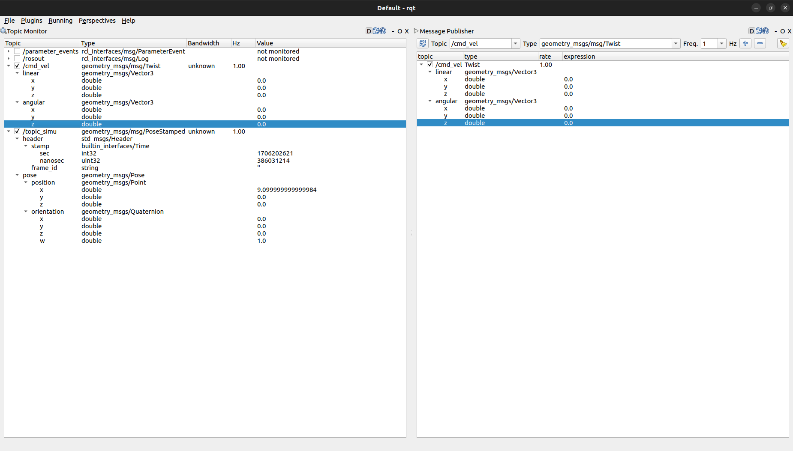

Puis lorsque je modifie `angular.z = 0.5`:

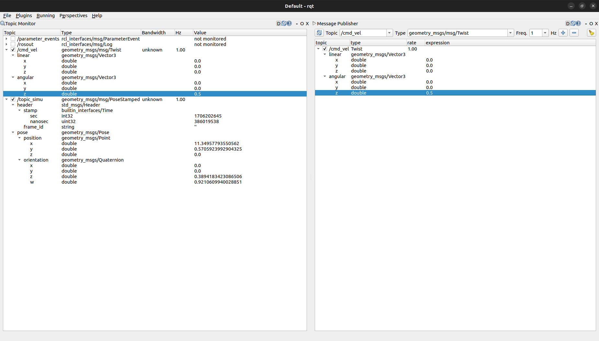

On voit bien que la vitesse angulaire augmente.

On a alors x[2] += dt * u1 avec u1 = 0.5.

Or x[1] += dt * sin[x[2]] donc y n'est plus nulle à partir de la modification de u1.

#### Question 7.

Visualisation avec PlotJuggler :

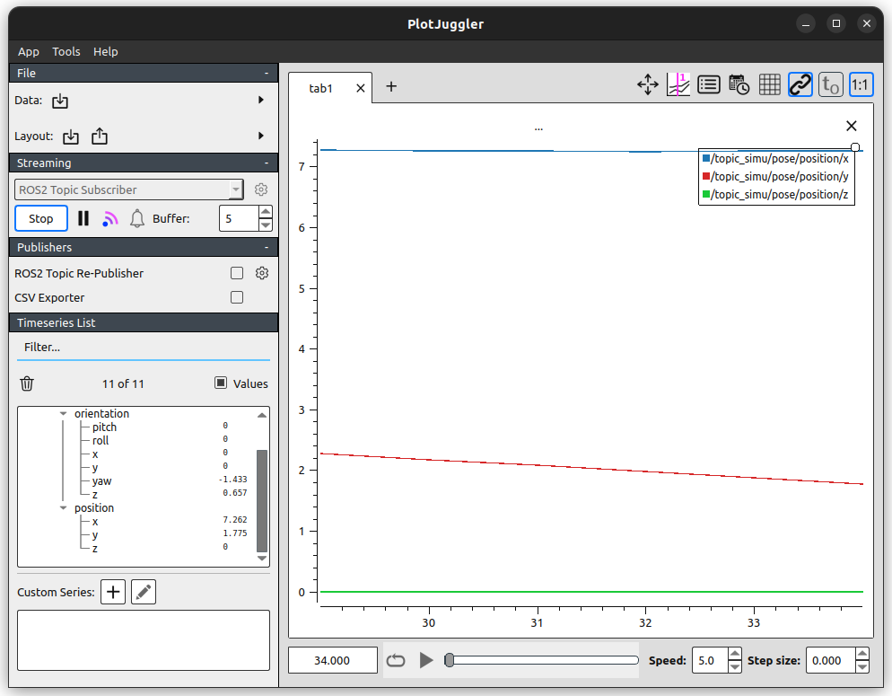

### 2.3 Roslaunch

#### Question 8.

Terminal 1 :
```
arne@arne-G3-3500:~/workspaceTdRos$ ros2 launch td2 td2_launch.py
[INFO] [launch]: All log files can be found below /home/arne/.ros/log/2024-01-25-18-40-40-258322-arne-G3-3500-29313
[INFO] [launch]: Default logging verbosity is set to INFO
[INFO] [nodeA-1]: process started with pid [29314]
[INFO] [NodeSimu-2]: process started with pid [29316]
[nodeA-1] [INFO] [1706204440.896978420] [node_A]: Publishing: 'Sinusoid value: -0.938917'
[nodeA-1] [INFO] [1706204441.397005565] [node_A]: Publishing: 'Sinusoid value: -0.988956'
[nodeA-1] [INFO] [1706204441.897008083] [node_A]: Publishing: 'Sinusoid value: -0.796833'
[nodeA-1] [INFO] [1706204442.397009014] [node_A]: Publishing: 'Sinusoid value: -0.409617'
[nodeA-1] [INFO] [1706204442.897012455] [node_A]: Publishing: 'Sinusoid value: 0.077889'
```
Terminal 2 :
```
arne@arne-G3-3500:~/workspaceTdRos$ ros2 topic list
/cmd_vel
/parameter_events
/rosout
/topic
/topic_simu
arne@arne-G3-3500:~/workspaceTdRos$ ros2 topic echo /topic
data: 'Sinusoid value: 0.226393'
---
data: 'Sinusoid value: 0.665658'
---
data: 'Sinusoid value: 0.941944'
---
data: 'Sinusoid value: 0.987611'
---
data: 'Sinusoid value: 0.791479'
---
data: 'Sinusoid value: 0.401564'
---
```

### 2.4 Parameters

#### Question 9.

```
void NodeSimu::init_parameters() {
    this->declare_parameter<double>("initial_x", 0.0);
    this->declare_parameter<double>("initial_y", 0.0);
    this->declare_parameter<double>("initial_theta", 0.0);

    initial_x_ = this->get_parameter_or("initial_x", 0.0);
    initial_y_ = this->get_parameter_or("initial_y", 0.0);
    initial_theta_ = this->get_parameter_or("initial_theta", 0.0);
}
```

#### Question 10.

Avec x_init = [1.0, 0.0, 0.0] et v = 0.0:
```
arne@arne-G3-3500:~/workspaceTdRos$ ros2 launch td2 td2_launch.py
[INFO] [launch]: All log files can be found below /home/arne/.ros/log/2024-01-26-12-13-06-539728-arne-G3-3500-14292
[INFO] [launch]: Default logging verbosity is set to INFO
Lancement du nodeSimu
[INFO] [NodeSimu-1]: process started with pid [14293]
[NodeSimu-1] [INFO] [1706267586.749819422] [nodeSimu]: Publishing (x, y, théta): 1.000000 0.000000 0.000000
[NodeSimu-1] [INFO] [1706267586.849797651] [nodeSimu]: Publishing (x, y, théta): 1.000000 0.000000 0.000000
[NodeSimu-1] [INFO] [1706267586.949851138] [nodeSimu]: Publishing (x, y, théta): 1.000000 0.000000 0.000000
[NodeSimu-1] [INFO] [1706267587.049808174] [nodeSimu]: Publishing (x, y, théta): 1.000000 0.000000 0.000000
[NodeSimu-1] [INFO] [1706267587.149831181] [nodeSimu]: Publishing (x, y, théta): 1.000000 0.000000 0.000000
```

Avec x_init = [1.0, 0.0, 0.0] et v = 1.0:
```
arne@arne-G3-3500:~/workspaceTdRos$ ros2 launch td2 td2_launch.py
[INFO] [launch]: All log files can be found below /home/arne/.ros/log/2024-01-26-12-15-21-215486-arne-G3-3500-14520
[INFO] [launch]: Default logging verbosity is set to INFO
Lancement du nodeSimu
[INFO] [NodeSimu-1]: process started with pid [14521]
[NodeSimu-1] [INFO] [1706267721.429022195] [nodeSimu]: Publishing (x, y, théta): 1.100000 0.000000 0.000000
[NodeSimu-1] [INFO] [1706267721.528900685] [nodeSimu]: Publishing (x, y, théta): 1.200000 0.000000 0.000000
[NodeSimu-1] [INFO] [1706267721.628936391] [nodeSimu]: Publishing (x, y, théta): 1.300000 0.000000 0.000000
[NodeSimu-1] [INFO] [1706267721.728949563] [nodeSimu]: Publishing (x, y, théta): 1.400000 0.000000 0.000000
[NodeSimu-1] [INFO] [1706267721.829060543] [nodeSimu]: Publishing (x, y, théta): 1.500000 0.000000 0.000000
[NodeSimu-1] [INFO] [1706267721.929011916] [nodeSimu]: Publishing (x, y, théta): 1.600000 0.000000 0.000000
[NodeSimu-1] [INFO] [1706267722.029031237] [nodeSimu]: Publishing (x, y, théta): 1.700000 0.000000 0.000000
[NodeSimu-1] [INFO] [1706267722.129026065] [nodeSimu]: Publishing (x, y, théta): 1.800000 0.000000 0.000000
[NodeSimu-1] [INFO] [1706267722.229037416] [nodeSimu]: Publishing (x, y, théta): 1.900000 0.000000 0.000000
[NodeSimu-1] [INFO] [1706267722.329053046] [nodeSimu]: Publishing (x, y, théta): 2.000000 0.000000 0.000000
[NodeSimu-1] [INFO] [1706267722.429023940] [nodeSimu]: Publishing (x, y, théta): 2.100000 0.000000 0.000000
```

### 2.5 Découverte de RVIZ

#### Question 11 et 12.

Au début rien ne s'affiche puisque le Fixed Frame est sur `map` et que mon topic est sur `carte`.

Après avoir changé le Fixed Frame sur `carte` on voit bien le bateau avancer :

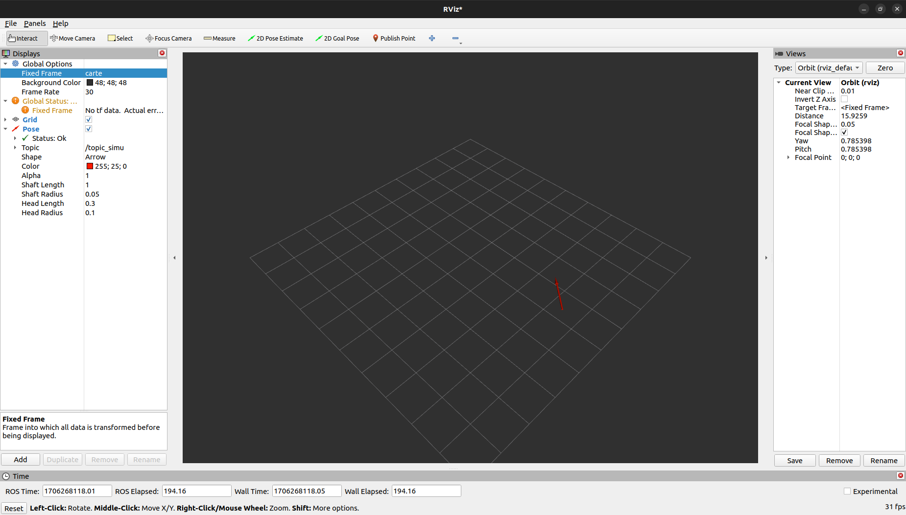

#### Question 13.

Après avoir ajouté le marker on voit bien le bateau avancer en 3D:

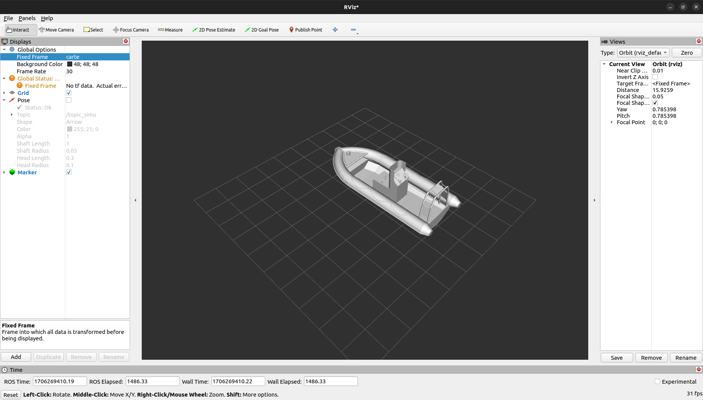

### 2.6 Installation de Packages additionnels

#### Question 14.

En utilisant les lignes de commande suivantes :
```
ros2 run mouse_teleop mouse_teleop -r /mouse_vel:=/cmd
```
et
```
ros2 run teleop_twist_keyboard teleop_twist_keyboard -r /teleop_vel:=/cmd
```
On peut contrôler le bateau avec la souris et le clavier.

## 3 Contrôleur du bateau

### 3.1 Loi de pilotage

#### Question 15.

En rajoutant un node `NodeControl` et `NodeCible` on peut contrôler le bateau pour qu'il aille vers une cible.

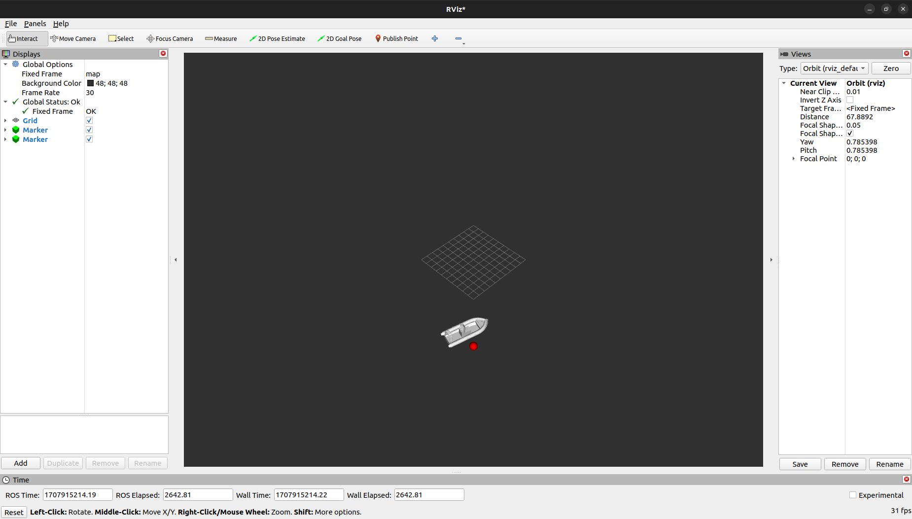

### 3.2 Node Graph & namespaces

#### Question 16.

On remarque que :

1. nodes -> ellipses
2. topics -> rectangles
3. flèches pointent depuis un publisher vers un subscriber
4. couleurs : je suis daltonien donc je ne peux pas dire

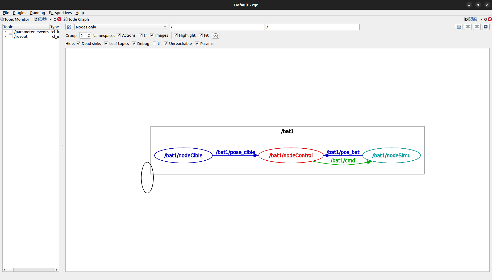

#### Question 17.

Pour lancer le launch file :
```
import os

from ament_index_python.packages import get_package_share_directory
from launch import LaunchDescription
from launch_ros.actions import Node

print("Lancement Q15")

# Fonction appelé par ros2 launch pour avoir la liste des nodes à lancer
def generate_launch_description():
        config = os.path.join(
                get_package_share_directory('td2'),
                'config', # repertoire
                'td2.yaml'
        )
        nodeS1 = Node(
                package='td2', # nom du package
                namespace='bat1',
                executable='NodeSimu', # nom de l'executable
                name='nodeSimu', # nom du node lors du lancement
                parameters=[config]
        )
        nodeC1 = Node(
                package='td2', # nom du package
                namespace='bat1',
                executable='NodeControl', # nom de l'executable
                name='nodeControl', # nom du node lors du lancement
                parameters=[config]
        )
        nodeCi1 = Node(
                package='td2', # nom du package
                namespace='bat1',
                executable='NodeCible', # nom de l'executable
                name='nodeCible', # nom du node lors du lancement
                parameters=[config]
        )

        return LaunchDescription([
                nodeS1,
                nodeC1,
                nodeCi1,
        ])
```

Pour le yaml :
```
bat1:
  nodeSimu: # Fait référence au nom du node executé
    ros__parameters: # Attention, il y a deux "_"
      init_pos:
      - 1.0
      - 0.0
      - 0.0
  nodeCible:
    ros__parameters:
      x_cible:
      - 10.0
      - 10.0
```

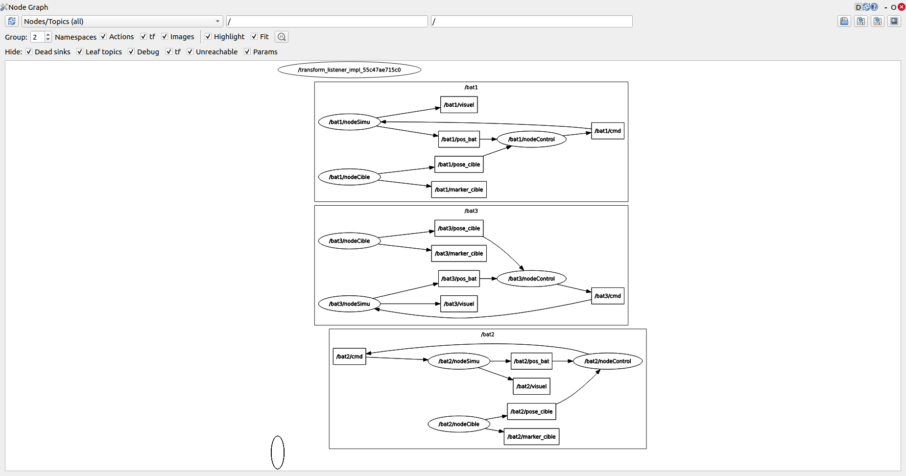

#### Question 18.

Voici le lien vers une vidéo de la simulation : https://youtu.be/Xerye8Xb8oQ


# TP3 ROS : Vers l’implémentation sur un robot réel

## 1 Le système de rejeu

#### Questions 1. et 2.

```
arne@arne-G3-3500:~/workspaceTdRos$ ros2 bag record -a
[INFO] [1707923862.753157721] [rosbag2_recorder]: Press SPACE for pausing/resuming
[INFO] [1707923862.755054661] [rosbag2_storage]: Opened database 'rosbag2_2024_02_14-16_17_42/rosbag2_2024_02_14-16_17_42_0.db3' for READ_WRITE.
[INFO] [1707923862.756606975] [rosbag2_recorder]: Listening for topics...
[INFO] [1707923862.756651775] [rosbag2_recorder]: Event publisher thread: Starting
[INFO] [1707923862.757296824] [rosbag2_recorder]: Subscribed to topic '/rosout'
[INFO] [1707923862.757678253] [rosbag2_recorder]: Subscribed to topic '/events/write_split'
[INFO] [1707923862.757730857] [rosbag2_recorder]: Recording...
[INFO] [1707923865.875960465] [rosbag2_recorder]: Subscribed to topic '/bat3/visuel'
[INFO] [1707923865.877490278] [rosbag2_recorder]: Subscribed to topic '/tf'
[INFO] [1707923865.879015227] [rosbag2_recorder]: Subscribed to topic '/parameter_events'
[INFO] [1707923865.879842569] [rosbag2_recorder]: Subscribed to topic '/bat1/pos_bat'
[INFO] [1707923865.880461386] [rosbag2_recorder]: Subscribed to topic '/bat3/cmd'
[INFO] [1707923865.881102686] [rosbag2_recorder]: Subscribed to topic '/bat1/marker_cible'
[INFO] [1707923865.881708694] [rosbag2_recorder]: Subscribed to topic '/bat1/pose_cible'
[INFO] [1707923865.882333150] [rosbag2_recorder]: Subscribed to topic '/bat1/visuel'
[INFO] [1707923865.883002182] [rosbag2_recorder]: Subscribed to topic '/bat2/marker_cible'
[INFO] [1707923865.883637693] [rosbag2_recorder]: Subscribed to topic '/bat1/cmd'
[INFO] [1707923865.884260829] [rosbag2_recorder]: Subscribed to topic '/bat2/pose_cible'
[INFO] [1707923865.884861817] [rosbag2_recorder]: Subscribed to topic '/bat2/pos_bat'
[INFO] [1707923865.885386295] [rosbag2_recorder]: Subscribed to topic '/bat2/visuel'
[INFO] [1707923865.885884552] [rosbag2_recorder]: Subscribed to topic '/bat2/cmd'
[INFO] [1707923865.886374313] [rosbag2_recorder]: Subscribed to topic '/bat3/pos_bat'
[INFO] [1707923866.300563172] [rosbag2_recorder]: Subscribed to topic '/bat3/marker_cible'
[INFO] [1707923866.303043591] [rosbag2_recorder]: Subscribed to topic '/bat3/pose_cible'
[INFO] [1707923878.424282203] [rosbag2_cpp]: Writing remaining messages from cache to the bag. It may take a while
[INFO] [1707923878.426074323] [rosbag2_recorder]: Event publisher thread: Exiting
[INFO] [1707923878.426130752] [rosbag2_recorder]: Recording stopped
arne@arne-G3-3500:~/workspaceTdRos$ ros2 bag play rosbag2_2024_02_14-16_17_42_0.db3
usage: ros2 bag play [-h] [-s {my_read_only_test_plugin,my_test_plugin,sqlite3}] [--read-ahead-queue-size READ_AHEAD_QUEUE_SIZE] [-r RATE] [--topics TOPICS [TOPICS ...]]
                     [--qos-profile-overrides-path QOS_PROFILE_OVERRIDES_PATH] [-l] [--remap REMAP [REMAP ...]] [--storage-config-file STORAGE_CONFIG_FILE] [--clock [CLOCK]] [-d DELAY]
                     [--disable-keyboard-controls] [-p] [--start-offset START_OFFSET] [--wait-for-all-acked TIMEOUT] [--disable-loan-message]
                     bag_path
ros2 bag play: error: argument bag_path: Bag path 'rosbag2_2024_02_14-16_17_42_0.db3' does not exist!
arne@arne-G3-3500:~/workspaceTdRos$ ls
build  install  log  rosbag2_2024_02_14-16_17_42  src
arne@arne-G3-3500:~/workspaceTdRos$ cd rosbag2_2024_02_14-16_17_42/
arne@arne-G3-3500:~/workspaceTdRos/rosbag2_2024_02_14-16_17_42$ ros2 bag play rosbag2_2024_02_14-16_17_42_0.db3

closing.

closing.
[INFO] [1707924036.566830671] [rosbag2_storage]: Opened database 'rosbag2_2024_02_14-16_17_42_0.db3' for READ_ONLY.
[INFO] [1707924036.584110843] [rosbag2_player]: Set rate to 1
[INFO] [1707924036.592515440] [rosbag2_player]: Adding keyboard callbacks.
[INFO] [1707924036.592541501] [rosbag2_player]: Press SPACE for Pause/Resume
[INFO] [1707924036.592551879] [rosbag2_player]: Press CURSOR_RIGHT for Play Next Message
[INFO] [1707924036.592559985] [rosbag2_player]: Press CURSOR_UP for Increase Rate 10%
[INFO] [1707924036.592567272] [rosbag2_player]: Press CURSOR_DOWN for Decrease Rate 10%

closing.

closing.
[INFO] [1707924036.592933450] [rosbag2_storage]: Opened database 'rosbag2_2024_02_14-16_17_42_0.db3' for READ_ONLY.
arne@arne-G3-3500:~/workspaceTdRos/rosbag2_2024_02_14-16_17_42$ ros2 bag play rosbag2_2024_02_14-16_17_42_0.db3

closing.

closing.
[INFO] [1707924093.313164670] [rosbag2_storage]: Opened database 'rosbag2_2024_02_14-16_17_42_0.db3' for READ_ONLY.
[INFO] [1707924093.324255060] [rosbag2_player]: Set rate to 1
[INFO] [1707924093.332832339] [rosbag2_player]: Adding keyboard callbacks.
[INFO] [1707924093.332862482] [rosbag2_player]: Press SPACE for Pause/Resume
[INFO] [1707924093.332871877] [rosbag2_player]: Press CURSOR_RIGHT for Play Next Message
[INFO] [1707924093.332879893] [rosbag2_player]: Press CURSOR_UP for Increase Rate 10%
[INFO] [1707924093.332888378] [rosbag2_player]: Press CURSOR_DOWN for Decrease Rate 10%

closing.

closing.
[INFO] [1707924093.333264562] [rosbag2_storage]: Opened database 'rosbag2_2024_02_14-16_17_42_0.db3' for READ_ONLY.
arne@arne-G3-3500:~/workspaceTdRos/rosbag2_2024_02_14-16_17_42$ ros2 bag play rosbag2_2024_02_14-16_17_42_0.db3

closing.

closing.
[INFO] [1707924115.953354349] [rosbag2_storage]: Opened database 'rosbag2_2024_02_14-16_17_42_0.db3' for READ_ONLY.
[INFO] [1707924115.964400735] [rosbag2_player]: Set rate to 1
[INFO] [1707924115.973240840] [rosbag2_player]: Adding keyboard callbacks.
[INFO] [1707924115.973273314] [rosbag2_player]: Press SPACE for Pause/Resume
[INFO] [1707924115.973286310] [rosbag2_player]: Press CURSOR_RIGHT for Play Next Message
[INFO] [1707924115.973297388] [rosbag2_player]: Press CURSOR_UP for Increase Rate 10%
[INFO] [1707924115.973307544] [rosbag2_player]: Press CURSOR_DOWN for Decrease Rate 10%

closing.

closing.
[INFO] [1707924115.973674049] [rosbag2_storage]: Opened database 'rosbag2_2024_02_14-16_17_42_0.db3' for READ_ONLY.
arne@arne-G3-3500:~/workspaceTdRos/rosbag2_2024_02_14-16_17_42$ cd .
arne@arne-G3-3500:~/workspaceTdRos/rosbag2_2024_02_14-16_17_42$ cd ..
arne@arne-G3-3500:~/workspaceTdRos$ ros2 bag info rosbag2_2024_02_14-16_17_42/

Files:             rosbag2_2024_02_14-16_17_42_0.db3
Bag size:          1.6 MiB
Storage id:        sqlite3
Duration:          15.663s
Start:             Feb 14 2024 16:17:42.757 (1707923862.757)
End:               Feb 14 2024 16:17:58.421 (1707923878.421)
Messages:          9043
Topic information: Topic: /bat3/pose_cible | Type: geometry_msgs/msg/PoseStamped | Count: 303 | Serialization Format: cdr
                   Topic: /bat3/marker_cible | Type: visualization_msgs/msg/Marker | Count: 303 | Serialization Format: cdr
                   Topic: /bat3/pos_bat | Type: geometry_msgs/msg/PoseStamped | Count: 126 | Serialization Format: cdr
                   Topic: /bat2/cmd | Type: geometry_msgs/msg/Twist | Count: 313 | Serialization Format: cdr
                   Topic: /bat2/visuel | Type: visualization_msgs/msg/Marker | Count: 126 | Serialization Format: cdr
                   Topic: /events/write_split | Type: rosbag2_interfaces/msg/WriteSplitEvent | Count: 0 | Serialization Format: cdr
                   Topic: /bat1/visuel | Type: visualization_msgs/msg/Marker | Count: 126 | Serialization Format: cdr
                   Topic: /bat3/visuel | Type: visualization_msgs/msg/Marker | Count: 126 | Serialization Format: cdr
                   Topic: /tf | Type: tf2_msgs/msg/TFMessage | Count: 931 | Serialization Format: cdr
                   Topic: /parameter_events | Type: rcl_interfaces/msg/ParameterEvent | Count: 0 | Serialization Format: cdr
                   Topic: /bat1/pos_bat | Type: geometry_msgs/msg/PoseStamped | Count: 126 | Serialization Format: cdr
                   Topic: /rosout | Type: rcl_interfaces/msg/Log | Count: 4554 | Serialization Format: cdr
                   Topic: /bat3/cmd | Type: geometry_msgs/msg/Twist | Count: 314 | Serialization Format: cdr
                   Topic: /bat1/marker_cible | Type: visualization_msgs/msg/Marker | Count: 314 | Serialization Format: cdr
                   Topic: /bat1/pose_cible | Type: geometry_msgs/msg/PoseStamped | Count: 314 | Serialization Format: cdr
                   Topic: /bat2/marker_cible | Type: visualization_msgs/msg/Marker | Count: 314 | Serialization Format: cdr
                   Topic: /bat2/pos_bat | Type: geometry_msgs/msg/PoseStamped | Count: 126 | Serialization Format: cdr
                   Topic: /bat1/cmd | Type: geometry_msgs/msg/Twist | Count: 313 | Serialization Format: cdr
                   Topic: /bat2/pose_cible | Type: geometry_msgs/msg/PoseStamped | Count: 314 | Serialization Format: cdr

```

#### Question 3.

On regarde un fichier bag plus vaste grâce à PlotJuggler. L'on remarque alors bien que les bateaux atteignent leurs cibles et tournent autour.

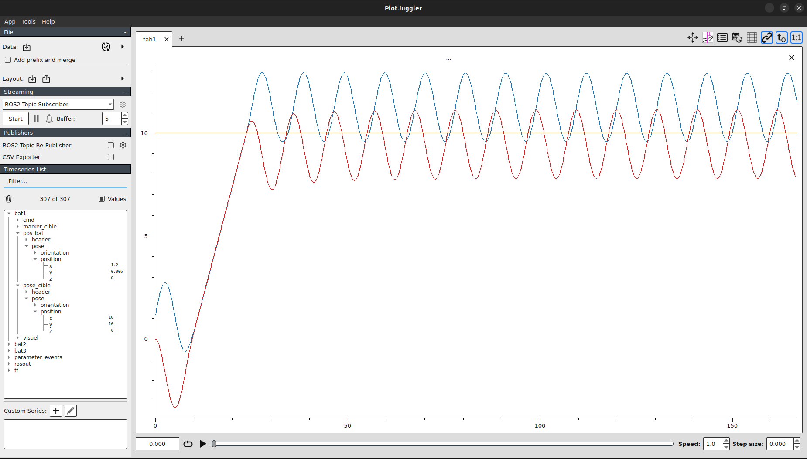

Ici, le bateau 1 va bien en (10, 10) atteindre sa cible puis avec les sinusoides il va tourner autour.

#### Question 4.

Pour afficher en python la trajectoire XY du bateau 1 on peut utiliser le code suivant :
```
x_values = []
y_values = []

## Get the messages
while reader.has_next():
    try:
        (topic, data, t) = reader.read_next()

        try:
            msg_type = get_message(type_map[topic])
            msg = deserialize_message(data, msg_type)

            msg = str(msg)

            # Use regular expressions to extract the x, y, z coordinates
            positions = re.findall(r'Point\(x=(.*?), y=(.*?), z=(.*?)\)', msg)

            # Convert the extracted coordinates to a list of lists
            positions_array = np.array([[float(x), float(y), float(z)] for x, y, z in positions])
            positions_array = positions_array[0]

            x_values.append(positions_array[0])
            y_values.append(positions_array[1])

            print('x = ', positions_array[0], 'y = ', positions_array[1])

        except Exception as e:
            print("Oops!  deserialization error ", e)
            print(topic, data, t, msg_type)
            pass

    except Exception as e:
        print("Oops!  read_next error ", e)
        pass

plt.plot(x_values, y_values)
plt.show()
```

Cela donne le graphe suivant :

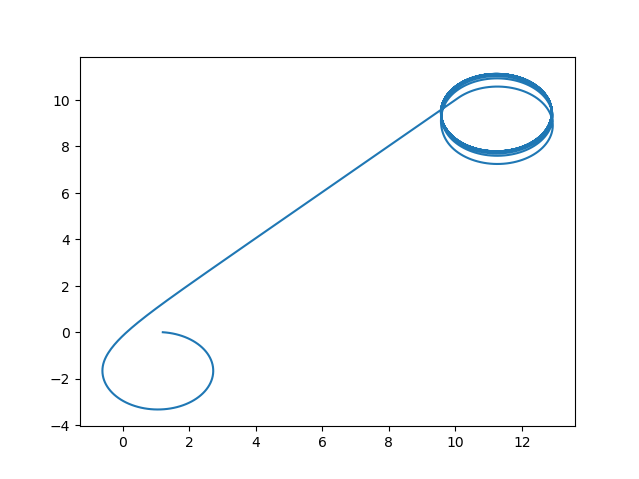

## 2 Les tf

#### Question 5.

Ici, on a un tf entre chaque bateau et la "map" (le monde).

Ainsi, on remarque en plus des bateaux sur rviz2 des lignes vers leurs positions initiales.

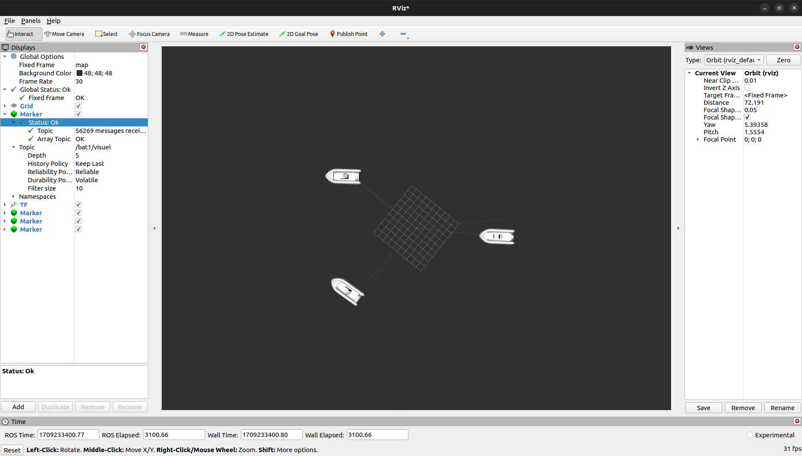

#### Question 6

Voici le TF Tree :

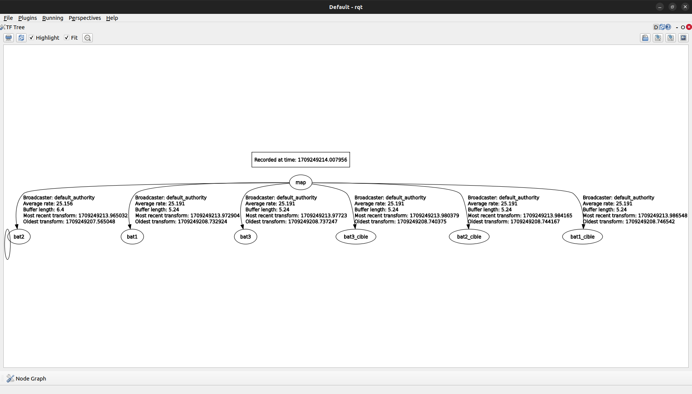

Et voici la preuve que la position du bateau est bien dans le repère du bateau :

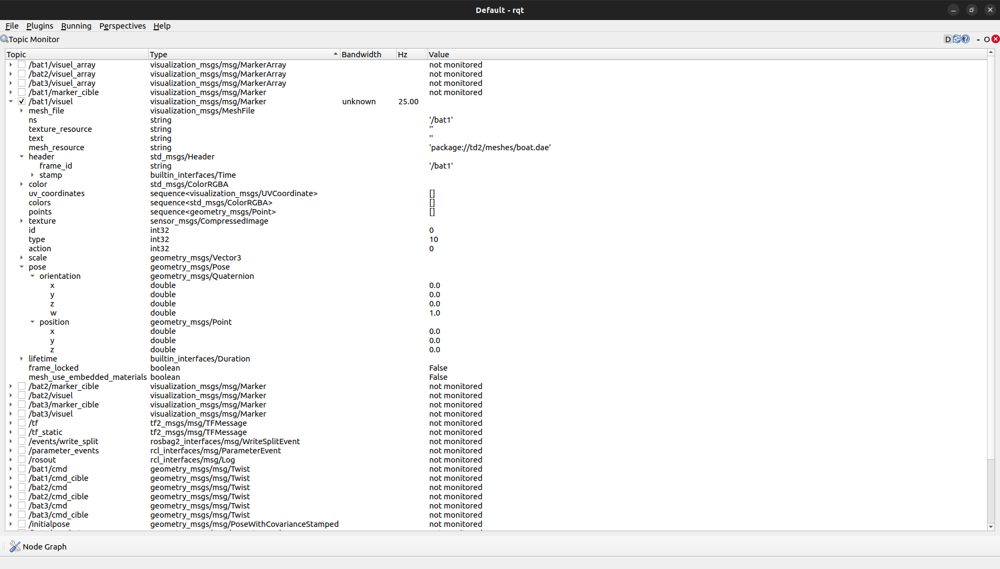

#### Question 7.

J'ai mis la tourelle à 3.5m car cela me paraissait rendre mieux sur le bateau sur rviz2.

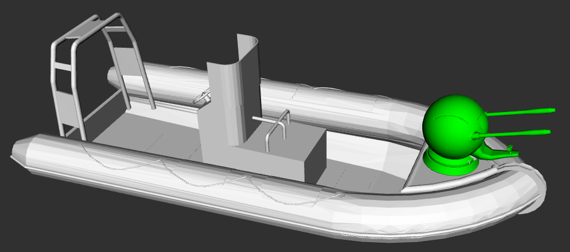

#### Question 8.

Voici le TF Tree :

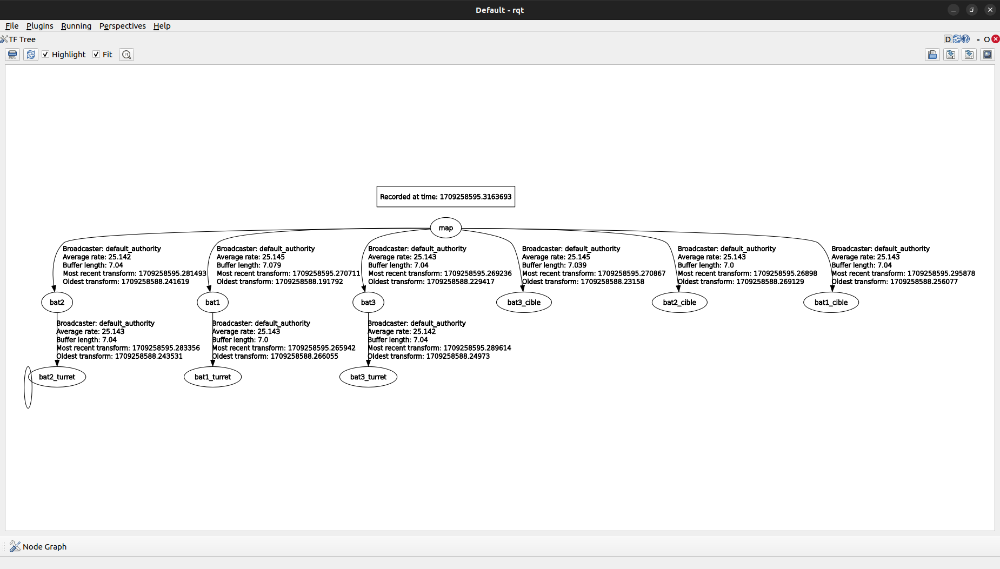

#### Question 9.

Je peux bien suivre ce qui se passe en point de vue posé sur le bateau.

#### Question 10 et 11.

Je n'ai pas réussi à faire ces deux dernieres questions.

Je ne trouve pas l'erreur dans mon code mais la tourelle ne pointe pas vers la cible lorsque le bateau tourne autour.

