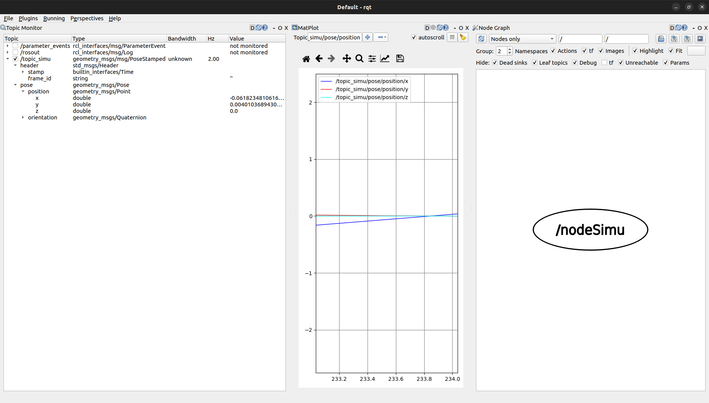
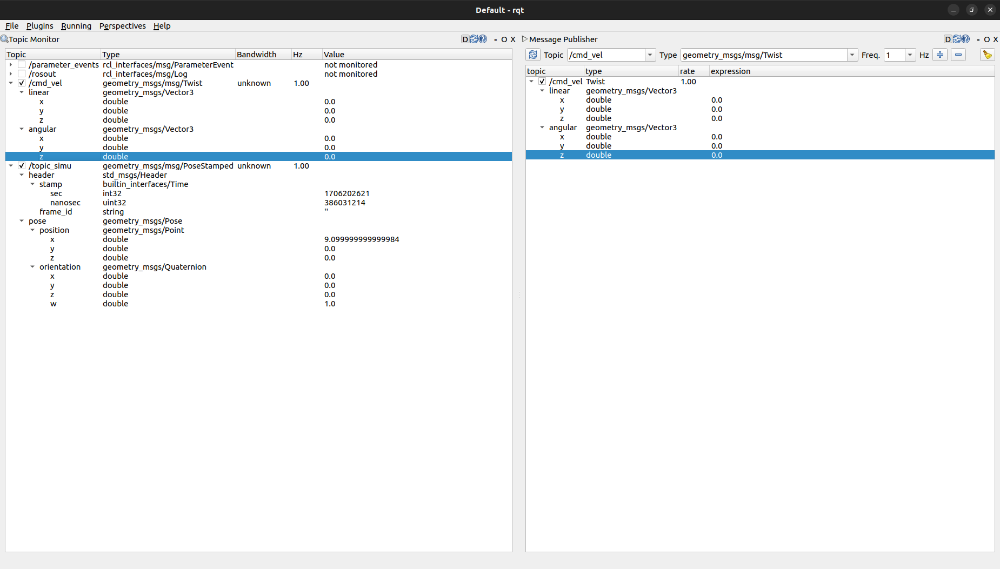
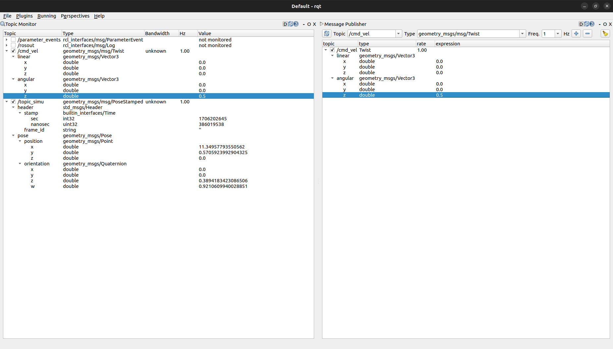

# TP2 ROS : Les outils de développements de ROS 2

## 1 Design d’une architecture

### 1.1 Présentation du problème

#### Question 1.

```
arne@arne-G3-3500:~/workspaceTdRos/src$ ros2 pkg create --build-type ament_cmake td2 --dependencies rclcpp example_interfaces tf2 geometry_msgs tf2_geometry_msgs
going to create a new package
package name: td2
destination directory: /home/arne/workspaceTdRos/src
package format: 3
version: 0.0.0
description: TODO: Package description
maintainer: ['arne <arne.jacobs@ensta-bretagne.com>']
licenses: ['TODO: License declaration']
build type: ament_cmake
dependencies: ['rclcpp', 'example_interfaces', 'tf2', 'geometry_msgs', 'tf2_geometry_msgs']
creating folder ./td2
creating ./td2/package.xml
creating source and include folder
creating folder ./td2/src
creating folder ./td2/include/td2
creating ./td2/CMakeLists.txt

[WARNING]: Unknown license 'TODO: License declaration'.  This has been set in the package.xml, but no LICENSE file has been created.
It is recommended to use one of the ament license identitifers:
Apache-2.0
BSL-1.0
BSD-2.0
BSD-2-Clause
BSD-3-Clause
GPL-3.0-only
LGPL-3.0-only
MIT
MIT-0
arne@arne-G3-3500:~/workspaceTdRos/src$ cd ..
arne@arne-G3-3500:~/workspaceTdRos$ colcon build --packages-select td2
Starting >>> td2     
Finished <<< td2 [2.24s]                  

Summary: 1 package finished [3.20s]
```

### 1.2 Rappels & Aide

Pour trouver les noms des fichier.hpp, cad leurs noms exacts on peut utiliser find dans /opt/ros/humble :
```
arne@arne-G3-3500:~/workspaceTdRos$ cd /opt/ros/
arne@arne-G3-3500:/opt/ros$ cd humble/
arne@arne-G3-3500:/opt/ros/humble$ find . -name "*pose_stamped*"
./local/lib/python3.10/dist-packages/geometry_msgs/msg/_pose_stamped_s.c
./local/lib/python3.10/dist-packages/geometry_msgs/msg/_pose_stamped.py
./include/geometry_msgs/geometry_msgs/msg/pose_stamped.hpp
./include/geometry_msgs/geometry_msgs/msg/pose_stamped.h
./include/geometry_msgs/geometry_msgs/msg/detail/pose_stamped__rosidl_typesupport_introspection_c.h
./include/geometry_msgs/geometry_msgs/msg/detail/pose_stamped__type_support.cpp
./include/geometry_msgs/geometry_msgs/msg/detail/pose_stamped__struct.hpp
./include/geometry_msgs/geometry_msgs/msg/detail/pose_stamped__functions.c
./include/geometry_msgs/geometry_msgs/msg/detail/pose_stamped__rosidl_typesupport_introspection_cpp.hpp
./include/geometry_msgs/geometry_msgs/msg/detail/pose_stamped__type_support.c
./include/geometry_msgs/geometry_msgs/msg/detail/pose_stamped__builder.hpp
./include/geometry_msgs/geometry_msgs/msg/detail/pose_stamped__type_support.h
./include/geometry_msgs/geometry_msgs/msg/detail/pose_stamped__functions.h
./include/geometry_msgs/geometry_msgs/msg/detail/pose_stamped__traits.hpp
./include/geometry_msgs/geometry_msgs/msg/detail/pose_stamped__rosidl_typesupport_fastrtps_c.h
./include/geometry_msgs/geometry_msgs/msg/detail/pose_stamped__struct.h
./include/geometry_msgs/geometry_msgs/msg/detail/pose_stamped__rosidl_typesupport_fastrtps_cpp.hpp

```

## 2 Simulateur du bateau

### 2.1 Premiers pas

#### Question 2.

Voir les fichiers : NodeSimu.cpp et NodeSimu.hpp.

#### Question 3.

Voici pour u = 0.9 et dt = 0.01 :
Terminal 1 :
```
arne@arne-G3-3500:~/workspaceTdRos$ ros2 run td2 NodeSimu
```
Terminal 2:
```
arne@arne-G3-3500:~/workspaceTdRos$ ros2 topic echo /topic_simu
header:
  stamp:
    sec: 1706190882
    nanosec: 132402987
  frame_id: ''
pose:
  position:
    x: 0.06997088231568546
    y: 0.0016796237555148823
    z: 0.0
  orientation:
    x: 0.0
    y: 0.0
    z: 0.027996342806157728
    w: 0.9996080255727643
---
header:
  stamp:
    sec: 1706190882
    nanosec: 632403006
  frame_id: ''
pose:
  position:
    x: 0.07995520618830804
    y: 0.002239331122118879
    z: 0.0
  orientation:
    x: 0.0
    y: 0.0
    z: 0.031994540465420426
    w: 0.9994880436405463
---
header:
  stamp:
    sec: 1706190883
    nanosec: 132480280
  frame_id: ''
pose:
  position:
    x: 0.08993473295285635
    y: 0.0028788943209627545
    z: 0.0
  orientation:
    x: 0.0
    y: 0.0
    z: 0.0359922262126696
    w: 0.9993520699194334
---
header:
  stamp:
    sec: 1706190883
    nanosec: 632367215
  frame_id: ''
pose:
  position:
    x: 0.09990882392296316
    y: 0.003598272420216198
    z: 0.0
  orientation:
    x: 0.0
    y: 0.0
    z: 0.0399893360850125
    w: 0.9992001065850022
---
```

### 2.2 Découverte de RQT & outils de plot

#### Question 4 et 5.

Pour lancer rqt :
```
arne@arne-G3-3500:~/workspaceTdRos$ rqt
```
Dedans on peut afficher les informations sur les nodes et les topics. On peut aussi afficher les graphes des topics et des nodes (voir la photo suivante):



PS : j'ai rajouté ceci :
```
msg.header.stamp = this->now(); // retourne un objet de type rclcpp::Time
```
Pour afficher les temps dans le graphe.

#### Question 6.

Terminal 1 :
```
arne@arne-G3-3500:~/workspaceTdRos$ ros2 run td2 NodeSimu
[INFO] [1706202529.735588089] [nodeSimu]: Commande Twist reçue : 0.000000
u1 = 0
[INFO] [1706202530.733768366] [nodeSimu]: Commande Twist reçue : 0.000000
u1 = 0
[INFO] [1706202531.735074422] [nodeSimu]: Commande Twist reçue : 0.000000
u1 = 0
```
Terminal 2 :
```
rqt
```
Sur rqt avec `angular.z = 0` :



Puis lorsque je modifie `angular.z = 0.5`:



On voit bien que la vitesse angulaire augmente.

On a alors x[2] += dt * u1 avec u1 = 0.5.

Or x[1] += dt * sin[x[2]] donc y n'est plus nulle à partir de la modification de u1.

#### Question 7.

Visualisation avec PlotJuggler :


### 2.3 Roslaunch

#### Question 8.

Terminal 1 :
```
arne@arne-G3-3500:~/workspaceTdRos$ ros2 launch td2 td2_launch.py
[INFO] [launch]: All log files can be found below /home/arne/.ros/log/2024-01-25-18-40-40-258322-arne-G3-3500-29313
[INFO] [launch]: Default logging verbosity is set to INFO
[INFO] [nodeA-1]: process started with pid [29314]
[INFO] [NodeSimu-2]: process started with pid [29316]
[nodeA-1] [INFO] [1706204440.896978420] [node_A]: Publishing: 'Sinusoid value: -0.938917'
[nodeA-1] [INFO] [1706204441.397005565] [node_A]: Publishing: 'Sinusoid value: -0.988956'
[nodeA-1] [INFO] [1706204441.897008083] [node_A]: Publishing: 'Sinusoid value: -0.796833'
[nodeA-1] [INFO] [1706204442.397009014] [node_A]: Publishing: 'Sinusoid value: -0.409617'
[nodeA-1] [INFO] [1706204442.897012455] [node_A]: Publishing: 'Sinusoid value: 0.077889'
```
Terminal 2 :
```
arne@arne-G3-3500:~/workspaceTdRos$ ros2 topic list
/cmd_vel
/parameter_events
/rosout
/topic
/topic_simu
arne@arne-G3-3500:~/workspaceTdRos$ ros2 topic echo /topic
data: 'Sinusoid value: 0.226393'
---
data: 'Sinusoid value: 0.665658'
---
data: 'Sinusoid value: 0.941944'
---
data: 'Sinusoid value: 0.987611'
---
data: 'Sinusoid value: 0.791479'
---
data: 'Sinusoid value: 0.401564'
---
```

### 2.4 Parameters

#### Question 9.

```
void NodeSimu::init_parameters() {
    this->declare_parameter<double>("initial_x", 0.0);
    this->declare_parameter<double>("initial_y", 0.0);
    this->declare_parameter<double>("initial_theta", 0.0);

    initial_x_ = this->get_parameter_or("initial_x", 0.0);
    initial_y_ = this->get_parameter_or("initial_y", 0.0);
    initial_theta_ = this->get_parameter_or("initial_theta", 0.0);
}
```

#### Question 10.

```